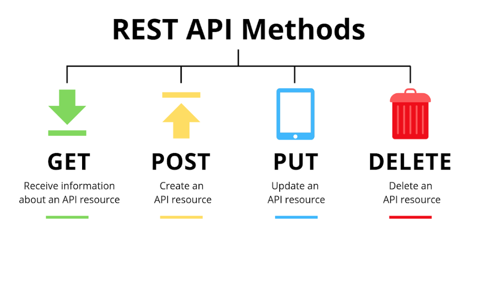

# Hands-on Flask-04 : Creating REST API (To-Do Application) with Flask Framework

Purpose of the this hands-on training is to give students basic understanding of REST API  and demonstrate how to create API using sqlite with Flask web application on Amazon Linux 2 EC2 instance.


## Learning Outcomes

At the end of the this hands-on training, students will be able to;

- demonstrate their knowledge of installing Python and Flask framework on Amazon Linux 2 EC2 instance.

- apply knowledge of building a web application with Python Flask framework.

- understand the basics of REST API architecture.

- design and implement REST API with Python Flask framework.

- configure connection to the `sqlite` database.

- work with a database using the SQL within Flask application.

- use git repo to manage the application versioning.

- run the web application on AWS EC2 instance using the GitHub repo as codebase.

## Outline

- Part 1 - Getting to know REST API

- Part 2 - Creating REST API Implementation with Flask framework using `sqlite` database on GitHub Repo

- Part 3 - Deploying the REST API Implementation with Flask Server on Amazon Linux 2 EC2 Instance

- Part 4 - Testing the API Implementation on EC2 Instance

## Part 1 - Getting to know REST API

[REST (REpresentational State Transfer)](https://en.wikipedia.org/wiki/Representational_state_transfer) is a software architectural style that defines a set of constraints to be used for creating Web services. 

Features of a REST architecture can be defined as followings:

- **Client-Server:** The server offers a service, and the client consumes it.

- **Stateless:** The server does not have to remember previous requests from the client, in other words the server does not keep the session information of the client. 

- **Cacheable:** The server must indicate to the clients and intermediaries if requests can be cached or not.

- **Uniform Interface:** The uniform interface is the fundamental of RESTful Services and simplifies the communication between the Server and Client. 

- **Layered System:** A client does not know whether it communicates with the end server, or with an intermediary along the way. Besides, a server can send requests to the multiple other servers/microservices to generate a response.

- **Code on demand (optional):** Servers can optionally provide executable code or scripts to clients in their context. 



Web services that conform to the REST architectural style, called **RESTful Web service** or **Web API (Application Programming Interface)** and designed to fit the Hypertext Transfer Protocol (HTTP).

Within the Web APIs, resources are represented by [URI (Uniform Resource Identifier)](https://en.wikipedia.org/wiki/Uniform_Resource_Identifier). The clients send requests to the server using URIs with the HTTP methods `GET`, `POST`, `PUT`, and `DELETE` and the Server send response with data in any media type but JSON format is the most commonly used one in the market. 

Within this hands-on, we will create a `To Do List` Application as Web Service.  Below table shows the standard implementation of REST API for `To Do` app and how the HTTP methods are designed to affect the given resources identified by URIs. 

| HTTP Method  | Action | Example|
| --- | --- | --- |
| `GET`     |   Obtain information about a resource | http://api.example.com/todos (retrieves list of all todos) |
| `GET`     |   Obtain information about a resource | http://api.example.com/todos/123 (retrieves todo with id=123) |
| `POST`    |   Create a new resource	            | http://api.example.com/todos (creates a new todo, from data provided with the request) |
| `PUT`     |	Update a resource               	| http://api.example.com/todos/123 (updates the todo with id=123, from data provided with the request) |
| `DELETE`  |	Delete a resource              	    | http://api.example.com/todos/123 (delete the todo with id=123) |


## Part 2 - Creating REST API Implementation with Flask framework using `sqlite` database on GitHub Repo 

- Create a `To Do` application as web service with base URL of `http://[public-dns-name-of-ec2]/` and expose the resources listed above within. 

- Define a to-do tasks with following fields:

    - task_id: unique identifier for tasks, type is numeric.

    - title: short task description, type is string.

    - description: long task description. type is text.

    - is_done: task completion state, type is boolean.

- Create folder named `flask-04-creating-rest-api-on-ec2-linux2` within `clarusway-python-workshop` repo

- Write an REST API application using `sqlite` database and save the complete code as `todo-api.py` under `hands-on/flask-04-creating-rest-api-on-ec2-linux2` folder.

```python
# Import Flask modules
from flask import Flask, jsonify, abort, request, make_response
from flask_sqlalchemy import SQLAlchemy

# Create an object named app
app = Flask(__name__)

# Configure sqlite database
app.config['SQLALCHEMY_DATABASE_URI'] = 'sqlite:///./todo-list.db'
app.config['SQLALCHEMY_TRACK_MODIFICATIONS'] = False
db=SQLAlchemy(app)

# Write a function named `init_todo_db` which initilazes the todo db
# Create todos table within sqlite db and populate with sample data
# Execute the code below only once.
def init_todo_db():
    drop_table = 'DROP TABLE IF EXISTS todos;'
    todos_table = """
    CREATE TABLE todos(
    task_id INTEGER PRIMARY KEY,
    title VARCHAR NOT NULL,
    description VARCHAR,
    is_done BOOLEAN NOT NULL DEFAULT 0 CHECK(is_done IN(0,1)));
    """
    data = """
    INSERT INTO todos (title, description, is_done)
    VALUES
        ("Project 2", "Work on project 2 with teammates", 1 ),
        ("Cloudformation Documentation", "Study and learn how to read cloudformation docs", 0),
        ("Work on CC Phonebook", "Solve python coding challenge about phonebook app", 0);
    """
    db.session.execute(drop_table)
    db.session.execute(todos_table)
    db.session.execute(data)
    db.session.commit()

# Write a function named `get_all_tasks` which gets all tasks from the todos table in the db,
# and return result as list of dictionary 
# `[{'task_id': 1, 'title':'XXXX', 'description': 'XXXXXX', 'is_done': 'Yes' or 'No'} ]`.
def get_all_tasks():
    query = """
    SELECT * FROM todos;
    """
    result = db.session.execute(query)
    tasks =[{'task_id':row[0], 'title':row[1], 'description':row[2], 'is_done': bool(row[3])} for row in result]
    return tasks

# Write a function named `find_task` which finds task using task_id from the todos table in the db,
# and return result as list of dictionary 
# `[{'task_id': 1, 'title':'XXXX', 'description': 'XXXXXX', 'is_done': 'Yes' or 'No'} ]`.
def find_task(id):
    query = f"""
    SELECT * FROM todos WHERE task_id={id};
    """
    row = db.session.execute(query).first()
    task = None
    if row is not None:
        task = {'task_id':row[0], 'title':row[1], 'description':row[2], 'is_done': bool(row[3])}
    return task


# Write a function named `insert_task` which inserts task into the todos table in the db,
# and return the newly added task as dictionary 
# `[{'task_id': 1, 'title':'XXXX', 'description': 'XXXXXX', 'is_done': 'Yes' or 'No'} ]`.
def insert_task(title, description):
    insert = f"""
    INSERT INTO todos (title, description)
    VALUES ('{title}', '{description}');
    """
    result = db.session.execute(insert)
    db.session.commit()

    query = f"""
    SELECT * FROM todos WHERE task_id={result.lastrowid};
    """
    row = db.session.execute(query).first()

    return {'task_id':row[0], 'title':row[1], 'description':row[2], 'is_done': bool(row[3])}

# Write a function named `change_task` which updates task into the todos table in the db,
# and return updated added task as dictionary 
# `[{'task_id': 1, 'title':'XXXX', 'description': 'XXXXXX', 'is_done': 'Yes' or 'No'} ]`.
def change_task(task):
    update = f"""
    UPDATE todos
    SET title='{task['title']}', description = '{task['description']}', is_done = {task['is_done']}
    WHERE task_id= {task['task_id']};
    """
    result = db.session.execute(update)
    db.session.commit()

    query = f"""
    SELECT * FROM todos WHERE task_id={task['task_id']};
    """
    row = db.session.execute(query).first()
    return {'task_id':row[0], 'title':row[1], 'description':row[2], 'is_done': bool(row[3])}

# Write a function named `remove_task` which removes task from the todos table in the db,
# and returns True if successfully deleted or False.
def remove_task(task):
    delete = f"""
    DELETE FROM todos
    WHERE task_id= {task['task_id']};
    """
    result = db.session.execute(delete)
    db.session.commit()

    query = f"""
    SELECT * FROM todos WHERE task_id={task['task_id']};
    """
    row = db.session.execute(query).first()
    return True if row is None else False


# Write a function named `home` which returns 'Welcome to the Callahan's To-Do API Service',
# and assign to the static route of ('/')
@app.route('/')
def home():
    return "Welcome to Callahan's To-Do API Service"

# Write a function named `get_tasks` which returns all tasks in JSON format for `GET`,
# and assign to the static route of ('/todos')
@app.route('/todos', methods=['GET'])
def get_tasks():
    return jsonify({'tasks':get_all_tasks()})


# Write a function named `get_tasks` which returns the task with given task_id in JSON format for `GET`,
# and assign to the static route of ('/todos/<int:task_id>')
@app.route('/todos/<int:task_id>', methods = ['GET'])
def get_task(task_id):
    task = find_task(task_id)
    if task == None:
        abort(404)
    return jsonify({'task found': task})

# Write a function named `add_task` which adds new task using `POST` methods,
# and assign to the static route of ('/todos')
@app.route('/todos', methods=['POST'])
def add_task():
    if not request.json or not 'title' in request.json:
        abort(400)
    return jsonify({'newly added task':insert_task(request.json['title'], request.json.get('description', ''))}), 201

# Write a function named `update_task` which updates an existing task using `PUT` method,
# and assign to the static route of ('/todos/<int:task_id>')
@app.route('/todos/<int:task_id>', methods=['PUT'])
def update_task(task_id):
    task = find_task(task_id)
    if task == None:
        abort(404)
    if not request.json:
        abort(400)
    task['title'] = request.json.get('title', task['title'])
    task['description'] = request.json.get('description', task['description'])
    task['is_done'] = int(request.json.get('is_done', int(task['is_done'])))
    return jsonify({'updated task': change_task(task)})

# Write a function named `delete_task` which updates an existing task using `DELETE` method,
# and assign to the static route of ('/todos/<int:task_id>')
@app.route('/todos/<int:task_id>', methods=['DELETE'])
def delete_task(task_id):
    task = find_task(task_id)
    if task == None:
        abort(404)
    return jsonify({'result':remove_task(task)})

# Write a function named `not_found` for handling 404 errors which returns 'Not found' in JSON format.
@app.errorhandler(404)
def not_found(error):
    return make_response(jsonify({'error': 'Not found'}), 404)

# Write a function named `bad_request` for handling 400 errors which returns 'Bad Request' in JSON format.
@app.errorhandler(400)
def bad_request(error):
    return make_response(jsonify({'error': 'Bad request'}), 400)


# Add a statement to run the Flask application which can be reached from any host on port 80.
if __name__== '__main__':
    init_todo_db()
    # app.run(debug=True)
    app.run(host='0.0.0.0', port=80)

```

- Add and commit all changes on local repo

- Push all the files to remote repo `clarusway-python-workshop` on GitHub.

## Part 3 - Deploying the REST API Implementation with Flask Server on Amazon Linux 2 EC2 Instance

- Launch an Amazon EC2 instance using the Amazon Linux 2 AMI with security group allowing SSH (Port 22) and HTTP (Port 80) connections.

- Connect to your instance with SSH.

```bash
ssh -i .ssh/call-training.pem ec2-user@ec2-3-15-183-78.us-east-2.compute.amazonaws.com
```

- Update the installed packages and package cache on your instance.

```bash
sudo yum update -y
```

- Install `Python 3` packages.

```bash
sudo yum install python3 -y
```

- Check the python3 version

```bash
python3 --version
```

- Install `Python 3 Flask` framework.

```bash
sudo pip3 install flask
```

- Install `flask_sqlalchemy`.

```bash
sudo pip3 install flask_sqlalchemy
```

## Part 4 - Testing the API Implementation on EC2 Instance

- Download the web application file from GitHub repo.

```bash
wget https://raw.githubusercontent.com/callahan-cw/clarusway-python-workshop/master/hands-on/flask-04-creating-rest-api-on-ec2-linux2/app-form-handling.py/todo-api.py 
```

- Run the `To Do List` API.

```bash
sudo python3 todo-api.py
```

- Open the `To Do List` API from the web browser.

```bash
http://ec2-3-15-183-78.us-east-2.compute.amazonaws.com
```

- Open the `To Do List` API default `/` page from the terminal with `curl` command.

```bash
curl -i http://ec2-3-15-183-78.us-east-2.compute.amazonaws.com
```

- List all task in  the `To Do List` API using `/todos` path and HTTP `GET` method with `curl` command.

```bash
curl -i http://ec2-3-15-183-78.us-east-2.compute.amazonaws.com/todos
```

- Retrieve task with `id=3` using `/todos/3` path and HTTP `GET` method with `curl` command.

```bash
curl -i http://ec2-3-15-183-78.us-east-2.compute.amazonaws.com/todos/3
```

- Try to retrieve non-existing task using `/todos/10` path and HTTP `GET` method with `curl` command to see 404 response.

```bash
curl -i http://ec2-3-15-183-78.us-east-2.compute.amazonaws.com/todos/6
```

- Create new task the `To Do List` using `/todos` path and HTTP `POST` method with `curl` command.

```bash
curl -i -H "Content-Type: application/json" -X POST -d '{"title":"Get some REST"}' http://ec2-3-15-183-78.us-east-2.compute.amazonaws.com/todos
```

- Add description to the task with `id=4` using `/todos/4` path and HTTP `PUT` method with `curl` command.

```bash
curl -i -H "Content-Type: application/json" -X PUT -d '{"description":"REST in Peace"}' http://ec2-3-15-183-78.us-east-2.compute.amazonaws.com/todos/4
```

- Update task with `id=2` as done using `/todos/2` path and HTTP `PUT` method with `curl` command.

```bash
curl -i -H "Content-Type: application/json" -X PUT -d '{"is_done":true}' http://ec2-3-15-183-78.us-east-2.compute.amazonaws.com/todos/4
```

- Delete task with `id=1` as done using `/todos/1` path and HTTP `PUT` method with `curl` command.

```bash
curl -i -H "Content-Type: application/json" -X DELETE http://ec2-3-15-183-78.us-east-2.compute.amazonaws.com/todos/1
```

- List all tasks with latest states from the web browser.

```bash
http://ec2-3-15-183-78.us-east-2.compute.amazonaws.com/todos
```
